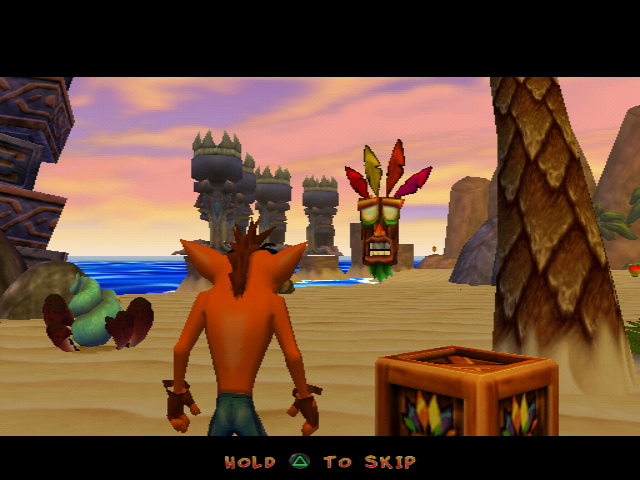

<div align="center">


# Crash Twinsanity Improved

**A fix-and-polish mod for the PAL release of *Crash Twinsanity* (PS2), built for PCSX2.**
Restores the cutscene skipping the developers cut, loads levels faster, adds 480p/60 Hz output, and ships widescreen,
HD texture and graphics presets. One script turns your own disc image into a patched ISO.

[](#quick-start)
[](https://pcsx2.net)
[](#quick-start)
[](https://alexmollard.github.io/Crash-Twinsanity-Improved/modding/what-changed)
[](https://www.python.org)
[](https://dotnet.microsoft.com)
[](https://github.com/AlexMollard/Crash-Twinsanity-Improved/commits/main)

[Features](#features) · [Quick start](#quick-start) · [Wiki](https://alexmollard.github.io/Crash-Twinsanity-Improved/) · [Credits](#credits)

</div>

> [!IMPORTANT]
> This repository contains **no game files**. You need your own copy of the PAL disc
> (*Crash Twinsanity (Europe, Australia) (En,Fr,De,Es,It)*, SLES-52568 v1.01, PCSX2 CRC `1510E1D1`).
> The build never modifies it and writes a separate `[Modded]` ISO next to it.

## Features

| | Feature | Where |
|:-:|---|---|
| ⏭️ | **Cutscene skip: hold △**, with an on-screen prompt in all five languages | ISO |
| 🎬 | **Movies answer △ too** — they only ever stopped for ✕ | ISO |
| 🛡️ | **Aku Aku invincibility that works** — three masks now survive TNT, Nitro and bombs | ISO |
| 🌑 | **Shadows on crates**, so you can see where you'll land | ISO |
| 🗿 | **A beaten boss stays beaten** — the wreck no longer hurts you | ISO |
| 👻 | **No more invisible Crash** after being hurt into a cutscene | ISO |
| ⏱️ | **Faster loading** — 25–35% off level loads, 40–50% with Fast CDVD | ISO + PCSX2 |
| 📺 | **480p / 60 Hz output** with the game's frame timing matched to it | ISO |
| 🖥️ | **Widescreen 16:9 or 21:9**, HD textures, and a graphics preset | PCSX2 |

<p align="center">

<br>
<sub>The prompt the retail game never shows you, because the skip behind it was disabled before release.</sub>
</p>

## Quick start

**You need** PCSX2 2.x with a PS2 BIOS, Python 3, your own PAL ISO, and — first time only, to build the level
tool — Visual Studio's MSBuild with .NET Framework 4.8.

1. **Drop your ISO** into the repository folder. Any file name works; it's recognised by its PCSX2 CRC.
2. **Run `Build Modded ISO.bat`.** It writes `<name> [Modded].iso` and installs the matching PCSX2 settings.
3. **Boot the `[Modded]` ISO** in PCSX2.

> [!TIP]
> If PCSX2 resets its settings, run `Apply CrashMod Settings.bat` with PCSX2 closed. It's safe to run any time.

> [!NOTE]
> On a real PS2, 480p needs a component or HDMI connection. Over SCART or composite to a PAL TV you get no picture.

## Everything else is on the wiki

**➤ [alexmollard.github.io/Crash-Twinsanity-Improved](https://alexmollard.github.io/Crash-Twinsanity-Improved/)**

| | |
|---|---|
| [What the mod changes](https://alexmollard.github.io/Crash-Twinsanity-Improved/modding/what-changed) | every fix, scene by scene, with the measurements — *spoilers* |
| [Roadmap](https://alexmollard.github.io/Crash-Twinsanity-Improved/roadmap) | shipped, next up, investigating, and what's been ruled out |
| [How the engine works](https://alexmollard.github.io/Crash-Twinsanity-Improved/engine/scripts) | the scripting system, cutscenes, objects, the archive, the renderer |
| [Building and modding](https://alexmollard.github.io/Crash-Twinsanity-Improved/modding/build) | the build, level recipes, executable patches, the test rig |
| [How the game was made](https://alexmollard.github.io/Crash-Twinsanity-Improved/history/development) | Traveller's Tales' Nu2 engine, what got cut, the six retail versions, speedruns |

```bash
cd wiki && npm install && npm start      # live preview on http://localhost:3000
```
## Credits

- **PeterDelta**: 480p / 60 Hz patch ([PeterDelta/PCSX2](https://github.com/PeterDelta/PCSX2))
- **CRASHARKI**: widescreen patch ([PCSX2/pcsx2_patches](https://github.com/PCSX2/pcsx2_patches)) and the HD texture pack ([ctwin-tp](https://github.com/CRASHARKI/ctwin-tp))
- **TechieSaru**: 21:9 fix ([GBAtemp thread](https://gbatemp.net/threads/648804))
- **Smartkin, NeoKesha and contributors**: [Twinsanity Editor](https://github.com/Smartkin/twinsanity-editor) and [twinsanity-reversed](https://github.com/Smartkin/twinsanity-reversed)

<sub>Crash Twinsanity is © its respective owners. This is an unofficial fan project and isn't affiliated with or endorsed by them.</sub>
